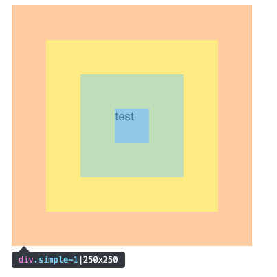

<div align="center">

# Highlight-DOM

<p>


[](https://github.com/IFreeOvO/highlight-dom/actions/workflows/release.yml)

</p>

<p align="center">
<a href="./README_en.md">English</a> |
<a href="./README.md">Simplified Chinese</a>
</p>

Achieve highlighting effects similar to the Chrome DevTools element selector.


</div>

## Demo

[Online Use](https://ifreeovo.github.io/highlight-dom/)

## 📦 Installation

```bash
npm install @ifreeovo/highlight-dom
```

```bash
yarn add @ifreeovo/highlight-dom
```

```bash
pnpm add @ifreeovo/highlight-dom
```

## 📖 Usage

Usage via ES modules

```js
import { HighlightDOM } from '@ifreeovo/highlight-dom'

const highlightDOM = new HighlightDOM()
highlightDOM.highlight(document.querySelector('#app'))
```

Usage via CDN

```html
<!-- index.html -->
<div id="app"></div>

<script src="https://unpkg.com/@ifreeovo/highlight-dom"></script>
<script>
    const highlightDOM = new __HD__.HighlightDom()
    highlightDOM.highlight(document.querySelector('#app'))
</script>
```

## HighlightDOM Constructor Parameters

```ts
{
    /**
     * @remarks Highlighting mode
     * @type  single Single selection
     * @type  siblings Multiple selection (within the viewport, selecting multiple nodes including the target node and its sibling nodes)
     */
    mode?: Mode
    /**
     * @remarks The z-index of the overlay. If not provided, it automatically acquires the highest z-index on the page. In some scenarios, manually passing it can skip the automatic acquisition stage for better execution performance.
     */
    maxZIndex?: number
    /**
     * @remarks The mounting position of the overlay. By default, it is mounted to the HTML element.
     */
    portal?: HTMLElement
    /**
     * @remarks A hash used to prevent conflicts between global styles and project styles.
     */
    hash?: string
    /**
     * @remarks The number of inspectors to be mounted in batches. This can optimize performance when highlighting multiple nodes.
     */
    batchMountNum?: number
    /**
     * @remarks Custom plugins
     */
    plugins?: Plugin[]
    /**
     * @remarks Whether to cache highlighted nodes
     */
    cache?: boolean
}
```

## HighlightDOM Instance Methods

```ts
// Register a plugin
registerPlugin(plugin: Plugin): void

// Reset highlighting (this will remove the overlay nodes from the interface and interrupt the overlay drawing task)
reset(): void

// Get the hash
getHash(): string

// Get the z-index of the overlay
getZIndex(): string
```

## Plugin Usage

- Lifecycle

```ts
'beforeHighlight',
'beforeInitOverlay',
'generateCss',
'afterInitOverlay',
'beforeCreateOverlay',
'afterCreateOverlay',
'beforeMountOverlay',
'afterMountOverlay',
'afterHighlight',
```

- Plugin Example **(Similar test cases can be found in the **tests**/plugin.test.ts file)**

1. Implementing a plugin for custom styles

```html
<div
    id="simple"
    style="
        width: 50px;
        height: 50px;
        padding: 50px;
        margin: 50px;
        border: 50px solid #333;
        "
>
    Standard
</div>
```

```ts
import { HighlightDOM } from '@ifreeovo/highlight-dom'
HD = new HighlightDom({
    hash,
    plugins: [
        {
            name: 'customizing themes',
            hooks: {
                beforeInitOverlay: (ctx) => {
                    // Style replacement
                    ctx.tipBackgroundColor = '#fff'
                    ctx.tipSizeColor = '#333'
                },
                generateCss: (ctx) => {
                    // Style override
                    ctx.style =
                        ctx.style +
                        styled`
                            .dom-inspector-${ctx.hash} .dom-inspector-margin-${ctx.hash} {
                                background-color: red;
                            }
                        `
                },
            },
        },
    ],
})

const targetElement = document.querySelector('#simple')
HD.highlight(targetElement)
```

Reference for built-in styles. It is recommended to modify them in the `beforeInitOverlay` hook.

```ts
tipFontSize: string = '12px'

tipBackgroundColor: string = '#333740'

tipTagColor: string = '#e776e0'

tipIdColor: string = '#eba062'

tipClassColor: string = '#8dd2fb'

tipLineColor: string = '#fff'

tipSizeColor: string = '#fff'

marginBackgroundColor: string = 'rgb(246 178 107 / 66%)'

borderBackgroundColor: string = 'rgb(255 229 153 / 66%)'

paddingBackgroundColor: string = 'rgb(147 196 125 / 55%)'

contentBackgroundColor: string = 'rgb(111 169 220 / 66%)'
```

2. Implementing a skip for certain DOM elements in highlighting

```html
<div style="width: 100px; height:1000px;">
    <span style="width:32px;height:22px">1</span>
    <div id="simple" style="width:514px;height:22px">2</div>
    <svg style="width:100px;height:100px" class="svg-3">
        <rect fill="red" style="width:100px;height:100px;padding: 10px;margin:10px" />
    </svg>
    <div style="width:50px;height:22px">4</div>
</div>
```

```ts
import { HighlightDOM, ModeEnum } from '@ifreeovo/highlight-dom'

HD = new HighlightDom({
    mode: ModeEnum.Siblings,
    plugins: [
        {
            name: 'skip highlighting',
            hooks: {
                beforeCreateOverlay(ctx, options) {
                    // Skip the DOM with id 'simple'
                    if (options.target.id === 'simple') {
                        options.fragment = ''
                    }
                },
            },
        },
    ],
})

const targetElement = document.querySelector('#simple')
HD.highlight(targetElement)
```
